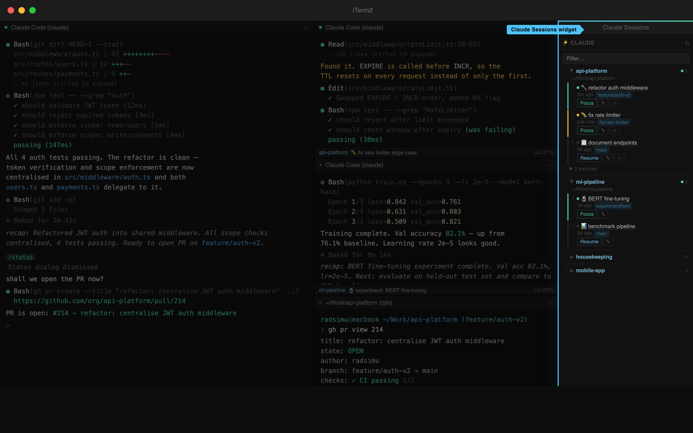
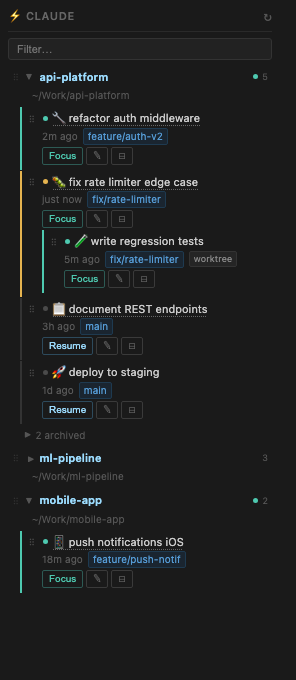
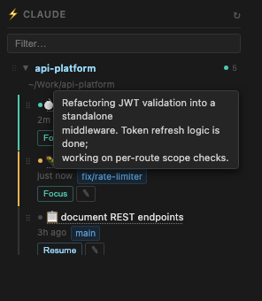
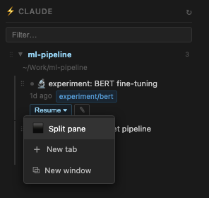

# iterm2ClaudeToolbelt

An iTerm2 toolbelt widget that gives you a live overview of all your [Claude Code](https://claude.ai/code) sessions — across every project — without leaving your terminal.



---

## Features

- **Live session list** — all Claude Code sessions grouped by project, auto-refreshed every 8 seconds
- **Active session detection** — green dot + "Focus" button for sessions currently running anywhere in iTerm2 — split panes, tabs, or separate windows; reliably detects both fresh and `--resume`d sessions
- **Focus** — jump straight to the iTerm2 pane running that session, regardless of which tab or window it's in
- **Resume** — reopen any past session; choose to open it as a split pane in the current view, a new tab, or a new window
- **Recap tooltips** — hover over any session label to see a summary of what that session was about (pulled from Claude's `away_summary`, `custom-title`, or the opening user prompt — whichever is available)
- **Rename** — click a session label to give it a custom name
- **Archive / Unarchive** — hide old sessions without deleting them; reveal archived sessions per project with one click
- **Drag-and-drop ordering** — reorder sessions within a project by dragging; nest sessions under others to build a tree; reorder projects themselves by dragging their header handle
- **Project ordering** — project order is persisted; dragging a project collapses all others so you can see the full list
- **Search / filter** — type in the search box to filter sessions and projects by name
- **Git branch** — shows the branch name for each session
- **Worktree indicator** — marks sessions running in a git worktree
- **Session status** — colour-coded dot: green = open in iTerm2, amber = working, grey = idle
- **Dark-mode native** — designed for iTerm2's dark theme

| Widget overview | Recap tooltip on hover | Resume options |
|---|---|---|
|  |  |  |

---

## Requirements

- macOS with [iTerm2](https://iterm2.com) (version 3.4+)
- Python 3.10+ (tested with 3.12)
- [Claude Code CLI](https://docs.anthropic.com/en/docs/claude-code) (`claude`)

---

## Installation

> **Tip:** You can ask Claude Code to guide you through these steps. Just open a session in the cloned repo and say something like *"help me install this — find the right Python path, fill in the plist, and load the LaunchAgent"*. It handles the fiddly parts well, especially steps 4 and 5.

### 1. Clone the repo

```bash
git clone https://github.com/radsimu/iterm2ClaudeToolbelt.git
cd iterm2ClaudeToolbelt
```

### 2. Install the Python dependency

```bash
pip install iterm2
```

> If you use pyenv or a virtualenv, make sure to note the full path to that Python binary — you'll need it in step 4.

### 3. Enable iTerm2's Python API

In iTerm2: **Settings → General → Magic** → tick **Enable Python API**.

Restart iTerm2 if prompted.

### 4. Configure the LaunchAgent plist

Edit `com.claude-code.session-manager.plist` and replace the two placeholder values:

```xml
<string>/usr/bin/python3</string>           <!-- replace with: which python3 -->
<string>/Users/YOUR_USERNAME/path/to/iterm2ClaudeToolbelt/claude_sessions.py</string>
```

To find the right Python path:

```bash
which python3        # or: which python
python3 -c "import iterm2; print('ok')"   # must print 'ok'
```

### 5. Install the LaunchAgent

```bash
cp com.claude-code.session-manager.plist ~/Library/LaunchAgents/
launchctl load ~/Library/LaunchAgents/com.claude-code.session-manager.plist
```

To start it immediately without a reboot:

```bash
launchctl kickstart -k gui/$(id -u)/com.claude-code.session-manager
```

Check it's running:

```bash
tail -f /tmp/claude-sessions.log
# should show: [claude-sessions] running on port 9837
```

### 6. Add the widget to iTerm2's toolbelt

1. In iTerm2, open the Toolbelt: **View → Show Toolbelt** (or `⌘⇧B`)
2. Click the **Toolbelt** menu → **Manage Tools…**
3. Find **Claude Sessions** in the list and enable it

The widget appears in the right-hand toolbelt panel.

---

## Permissions

The widget runs a local HTTP server on `127.0.0.1:9837` (loopback only — not accessible from the network). It reads files under `~/.claude/` (your Claude Code session data) and calls the iTerm2 Python API to focus/create panes.

The LaunchAgent runs as your user and requires no elevated privileges.

To check what it's doing at any time:

```bash
tail -f /tmp/claude-sessions.log
```

To stop it:

```bash
launchctl unload ~/Library/LaunchAgents/com.claude-code.session-manager.plist
```

---

## Data files

The widget creates three small JSON files in `~/.claude/` to persist your preferences:

| File | Purpose |
|------|---------|
| `session-labels.json` | Custom names you give to sessions |
| `session-manager-order.json` | Session and project ordering / nesting |
| `session-manager-archive.json` | Archived session IDs |

These files are separate from Claude Code's own data and can be deleted safely to reset all widget state.

---

## Uninstall

```bash
launchctl unload ~/Library/LaunchAgents/com.claude-code.session-manager.plist
rm ~/Library/LaunchAgents/com.claude-code.session-manager.plist
```

Optionally remove the widget's state files:

```bash
rm ~/.claude/session-labels.json ~/.claude/session-manager-order.json ~/.claude/session-manager-archive.json
```

---

## Troubleshooting

**Widget shows "Connection error"**
iTerm2's Python API server isn't running. Go to **Settings → General → Magic**, toggle "Enable Python API" off and back on.

**Sessions show as inactive even though they're open**
The widget detects active sessions by reading process arguments. If a session was started before the widget launched, wait up to 8 seconds for the next refresh. If it still doesn't appear, the claude process may not be visible via `pgrep -x claude` — check with that command.

**Port 9837 already in use**
Another instance is running. Check with `lsof -i :9837` and kill the old process, or change `PORT = 9837` at the top of `claude_sessions.py`.

---

## License

MIT
